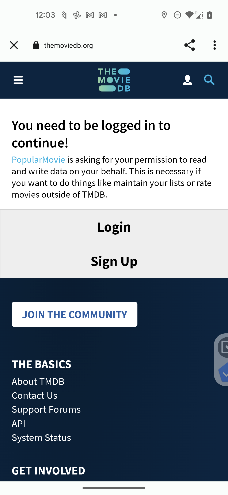

# IheNkiri


[](https://codecov.io/gh/jerryOkafor/IheNkiri)
[](https://codeclimate.com/github/jerryOkafor/IheNkiri/maintainability)

This project demonstrates the latest tools and trends in Modern Android application development
using
The [Movie Db API](https://developer.themoviedb.org/reference/intro/getting-started)
and [Free Figma Design Template](https://www.figma.com/file/gbaO5pgTz0mOZXvFOPCeue/TMDB-(Community)?type=design&node-id=47-2&mode=design&t=Px7eAl5IDpKxQrYF-0).

## Features

- Generates and upload Coverage report CodeCov using Jacoco Coverage report plugin
- Enforcing code coverage metrics using Jacoco Coverage Verification

https://www.toptal.com/android/android-apps-mvvm-with-clean-architecture
https://slackhq.github.io/circuit/

## Screenshots

<p align="center">
  
</p>

# Development Environment

# Build

IheNkiri `app` contains the usual `debug` and `release` build variants.

It also contains the `androidTest` module with the android test plugin: `com.android.test` used to
run all the Instrumented tests, or tests under the `androidTest` folder for all the modules. It
targets the the app module and other library module. The advantage is that we get to run all the
android tests from a single entry point and avoiding stating the emulator each time we change a
module which can be very slow. This is very optional, we are already considering running all the UI
tests using robolectric instead of a real device or an emulator

# Built with

- [Kotlin](https://kotlinlang.org/) - Official programming language for Android development.
- [Jetpack Compose](https://developer.android.com/jetpack/compose) - Modern UI toolkit for Android.
- [Splash Screen API](https://developer.android.com/develop/ui/views/launch/splash-screen) - Lets
  Ihenkiri app launch wit a nice and customisable animation.
- [Coroutines](https://kotlinlang.org/docs/reference/coroutines-overview.html) - For asynchronous or
  non-blocking programming.
    - [Flow](https://kotlin.github.io/kotlinx.coroutines/kotlinx-coroutines-core/kotlinx.coroutines.flow/-flow/)
      An asynchronous data stream that sequentially emits values and completes normally or with
      an exception.
      This is used to communicate b/w the Date layers and the UI layers.
    - [StateFlow and SharedFlow](https://developer.android.com/kotlin/flow/stateflow-and-sharedflow) -
      StateFlow and SharedFlow are Flow APIs that enable flows to optimally emit state updates and
      emit values to multiple consumers. StateFlow or SharedFlow is used together with ViewModel to
      realize an observable StateHolder that is not directly coupled with the UI. The UI layer
      observes changes in the StateHolder (ViewModel) and react to them.
- [Android Architecture Components](https://developer.android.com/topic/libraries/architecture) -
  Collection of libraries that help you design robust, testable, and maintainable apps.
    - [ViewModel](https://developer.android.com/topic/libraries/architecture/viewmodel) - Stores
      UI-related data that isn't destroyed on UI changes.
- [Dagger-Hilt Dependency Injection](https://developer.android.com/training/dependency-injection) -
    - [Hilt-Dagger](https://dagger.dev/hilt/) - Standard library to incorporate Dagger dependency
      injection into an Android application.
    - [Hilt-ViewModel](https://developer.android.com/training/dependency-injection/hilt-jetpack) -
      DI for injecting `ViewModel`.
- [GSON](https://github.com/google/gson) - A modern JSON library for Kotlin and Java.
- [Retrofit](https://square.github.io/retrofit/) - A type-safe HTTP client for Android and Java.
- [Coil](https://github.com/coil-kt/coil) - An image loading library for Android backed by
  Kotlin
  Coroutines.
- [Desugar](https://developer.android.com/studio/write/java8-support) - Allows us to use Java 8
  language features and APIs.
- [Android Jetpack](https://developer.android.com/jetpack) - A suite of libraries to help developers
  follow best practices, reduce boilerplate code, and write code that works consistently across
  Android versions and devices so that developers can focus on the code they care about.
    - [Browser](https://developer.android.com/jetpack/androidx/releases/browser) - Helps us webpages
      in the user's default browser. Used primarily to complete the OAuth 2.0 sign in flow using the
      Movies Db Api.
- [Accompanist]
  Accompanist is a group of libraries that aim to supplement Jetpack Compose with features that are
  commonly required by developers but not yet available
    - [System UI Controller](https://google.github.io/accompanist/systemuicontroller/) - used to go
      edge-to-edge in your activity and change the system bar colors and system bar icon colors, use
      the new
    - [Test Harness](https://google.github.io/accompanist/testharness/) - A library providing a test
      harness for UI components.

## Testing

- [TestParameterInjector](https://github.com/google/TestParameterInjector) - A simple yet powerful
  parameterized test runner for Java.
- [Roborazzi](https://github.com/takahirom/roborazzi) - helps to validate the app's appearance and
  functionality
- [Robolectric](https://robolectric.org/) - a framework that brings fast and reliable unit tests to
- Android
- [Robolectric Shadows](https://robolectric.org/extending/) - use shadow objects to simulate Android
  behavior in a non-Android environment.

# Modularization

IheNkiri is completely modularised based on the approach using
in [Now in Android](https://github.com/android/nowinandroid) repo. We have mainly `core`
and `feature` packages holding the core and feature of the app. In addition, we have
the `androidTest` and `screenshotTest` modules for running Instrumented Test and Screenshot test.

For more information, [Check Here]()

# Code Quality

To guarantee code quality across pull request and/or from different contributors, we have integrated
detekt and ktlint.

```bash
./gradlew detekt ktlint 
```

Alternatively, if you have ktlint installed locally, you can also run the following command:

```bash
ktlint -F

```

# Testing

For efficient testing of all components, **IheNkiri**
uses [Hilt](https://developer.android.com/training/dependency-injection/hilt-android) to inject test
components during tests.

Most of the the data layer components are defined as `interfaces` with various concrete
implementations which provides these interfaces during tests e.g
(DefaultXRepository,TestXRepository) -> Repository

During testing, we have a mix of Mock and Fake. Mocks are used when convenient and we are
considering removing all mocks so that the testing would depended only on Fakes. We use the Hilt
Testing APIs to replace modules/components during testing as shown below:

```kotlin
@Module
@TestInstallIn(
    components = [SingletonComponent::class],
    replaces = [DispatchersModule::class],
)
object TestDispatchersModule {}

```

We also use manual constructor injection for testing ViewModels when necessary.

Using Fakes/Test doubles is generally encouraged as better than mocks as these Fakes/Test Doubles
implement the same interface as the production code and also provides simplified (but still
realistic) implementation with additional testing hooks. This results in less brittle tests that may
exercise more production code quality, instead of just verifying specific calls against mocks.

we have the following tests on **IheNkiri**

- Unit tests - Runs all the local JVM tests, this can be invoked as follows:

```bash
./gradlew testDebugUnitTest
```

- Instrumentation tests - Runs all the instrumentation tests (tests that requires physical device or
  emulators). Currently, we have all theese test in the `androidTest` module and can eb run using
  the following command
-

```bash
./gradlew :androidTest:connectedDebugAndroidTest
```

- Screenshot tests (Coming soon) - This is a new form of tests that takes screenshots of Design
  System components
  and other components, save them, and subsequently verifies them against new records.This helps
  detect obvious changes in the Pixels which might indicate a deviation in the core dependencies or
  something the developer needs to take care of. This has been said to tbe faste and better than
  doing multiple assertions for a given UI component. The screenshot tests lives in
  the `screenshotTest` module and can be invoked using the following command:

Generate screenshots

```bash
./gradlew :screenshotTest:recordRoborazziDebug

```

Compare screenshots

```bash
./gradlew :screenshotTest:compareRoborazziDebug

```

Verify screenshots

```bash
./gradlew :screenshotTest:verifyRoborazziDebug

```

Verify & record screenshots

```bash
./gradlew :screenshotTest:verifyAndRecordRoborazziDebug

```

We use Roborazzi to achieve this screenshot testing.

# Architecture

[Todo]

# License

**IheNkiri** is didtributed under the terms of the MIT License. See the [License](LICENSE) for more
details.
